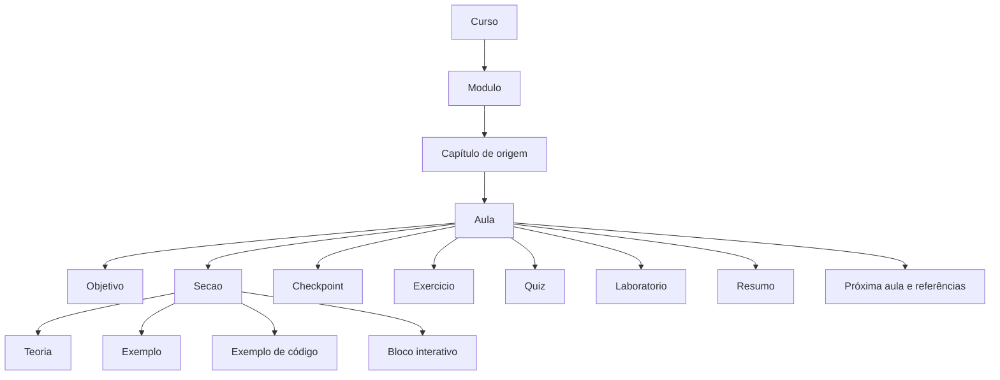
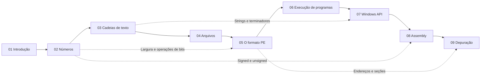

# Arquitetura pedagógica

## Proposta

A trilha ensina a passar da representação de números e texto à leitura de estruturas de executáveis, chamadas de funções e alteração controlada de comportamento. O livro continua sendo a fonte primária. O planejamento mantém seus nove capítulos e transforma páginas densas em unidades de aprendizado menores.

**63 aulas e 35 laboratórios são uma proposta de organização**, não a contagem de aulas prontas nem de exercícios publicados no livro. A fonte contém cinco seções explicitamente intituladas Exercício/Exercícios, além de tarefas, perguntas e programas a reproduzir ao longo dos capítulos. Quizzes, feedback automático, objetivos, rubricas e algumas atividades visuais serão complementos pedagógicos identificados como tais.

O [plano estruturado](../analysis/course-plan.json) associa as 41 páginas didáticas a intervalos de linhas sem lacunas nem sobreposições. Os 116 blocos existentes nessas páginas são atribuídos exatamente uma vez. Os outros 25 blocos pertencem aos apêndices e terão tratamento de referência ou prática reutilizável. Todas as 51 páginas Markdown têm destino, inclusive `SUMMARY.md` como estrutura e o histórico fora do sumário como conteúdo editorial.

## Estrutura

“Capítulo de origem” conserva a identidade e a hierarquia de cada página do livro. Uma página pode alimentar várias aulas; uma estrutura como Cabeçalhos mantém seus subcapítulos. A interface apresenta a trilha pela sequência de aulas, sem exigir que o aluno entenda esse modelo interno.

## Dependências

A sequência original é a trilha padrão. Os pré-requisitos específicos são visíveis na aula e levam à seção necessária. A navegação permanece livre: o aluno pode consultar um assunto posterior e receber orientação de contexto, sem bloqueios artificiais. O sistema recomenda o próximo conteúdo ainda não concluído, respeitando essa sequência e a atividade atual.

Antes de aulas PE que usam RVA, um bloco curto apresenta a distinção entre endereço e posição no arquivo e remete à aula de Endereçamento. Isso evita depender de um conceito só formalizado adiante. Nenhuma conversão será ensinada como soma direta de RVA com offset sem considerar as seções.

## Anatomia de uma aula

1. Orientação: módulo, capítulo, posição na trilha, progresso, dificuldade e tempo estimado.
2. Objetivo observável: o que o aluno deverá conseguir fazer ao terminar.
3. Pré-requisitos vinculados a aulas ou conceitos específicos.
4. Explicação técnica adaptada com todos os tópicos relevantes da seção original.
5. Exemplo original, com linguagem, ambiente, arquitetura e contexto de execução declarados.
6. Interação que altera dados e evidencia uma relação técnica concreta.
7. Checkpoint com pergunta ou verificação curta e feedback explicativo.
8. Exercício ou laboratório quando o tema comporta prática; não adicionar execução a um protótipo apenas para preencher espaço.
9. Solução comentada, acessível por ação explícita, e diferenças em relação à tentativa.
10. Resumo e próximo passo, incluindo o ponto relevante de revisão.

As seções não precisam repetir todos os componentes. Uma introdução pode privilegiar exemplos conceituais; uma aula de Assembly pode ocupar quase toda a tela com a bancada. A composição acompanha a tarefa.

## Aula trabalhada: registradores e subregistradores

**Fonte:** `08-assembly/registradores.md`, linhas 1–104. **Modo:** Intel x86-64 / long mode. **Pré-requisitos:** tamanhos BYTE/WORD/DWORD/QWORD e notação hexadecimal. **Objetivo:** prever como escrever em uma parte de RAX altera seus aliases. **Tempo proposto:** cerca de 20 minutos, sujeito à calibração durante os testes com alunos.

A teoria preserva os 16 GPRs, convenções de uso e os três diagramas de subdivisão: RAX/RBX/RCX/RDX; RSI/RDI/RBP/RSP; R8–R15. O diagrama interativo usa faixas de bits reais e mantém nomes e tamanhos visíveis. O esquema original fica acessível junto da explicação.

O exemplo original `mov rax, 0x1122334455667788` alimenta a visualização de EAX, AX, AH e AL. A prática complementar acrescenta escritas parciais para o aluno comparar comportamentos:

| Ação | Estado esperado de RAX | Relação ensinada |
| --- | --- | --- |
| `mov rax, 0x1122334455667788` | `0x1122334455667788` | Escrever todos os 64 bits |
| `mov al, 0xaa` | `0x11223344556677aa` | Atualizar apenas os oito bits baixos |
| `mov eax, 0x10` | `0x0000000000000010` | Escrita de 32 bits zera a metade alta em long mode |
| `xor eax, eax` | `0x0000000000000000` | Zerar e observar o efeito sobre flags |

Cada passo mostra antes/depois e realça a faixa alterada, com indicação textual para quem não distingue as cores. Valores de 64 bits usam `BigInt` internamente e strings hexadecimais nos contratos; não passam por `Number` com perda de precisão.

Checkpoint: prever EAX, AX, AH e AL depois da primeira instrução. Exercício: conservar os bits superiores enquanto altera o byte baixo. Quiz: distinguir escrita em AX de escrita em EAX. Solução: explicar a máscara afetada e a regra de zero-extension. O resumo retoma o efeito de aliases antes de encaminhar à montagem do primeiro PE.

O simulador modela as instruções declaradas e permite modificar o exemplo. Flags indefinidas têm estado “indefinido”; MOV preserva flags. A origem do exemplo e o caráter complementar da atividade ficam identificados. Uma correção editorial não é apresentada como se fosse a afirmação original do livro.

## Laboratórios

O [catálogo de 35 laboratórios](../analysis/labs.json) define origem, motor proposto, resultado de aprendizado, relação com aulas e critério de conclusão. Todos estão no estado `planned-not-implemented`.

Os laboratórios se distribuem entre representação numérica, operações de bits, codificações, arquivos, PE, carregamento, Windows API, Assembly e depuração. Cada bancada pode reaparecer em várias aulas com fixtures e objetivos diferentes. O aluno também consegue abri-la no Playground sem a sequência da aula.

A execução de C portátil demonstra código e stdout; a geração de PE demonstra estrutura Windows por compilação cruzada; a simulação de Windows API evidencia parâmetros e efeitos em recursos virtuais. Essas três experiências têm nomes e resultados distintos. Um arquivo ELF produzido em Linux não serve como substituto de um PE em uma aula sobre seções Windows.

Os apêndices ASCII e Latin-1 viram tabelas consultáveis e verificáveis; padrões Assembly viram receitas executáveis em contexto controlado; a lista Windows API vira referência por categoria e função; as 97 entradas de ferramentas continuam consultáveis com o rótulo da fonte e verificação de atualidade separada.

## Progresso e avaliação

Leitura iniciada e conclusão explícita são eventos diferentes. Uma aula iniciada não conta como concluída pelo simples fato de o aluno ter rolado a página. Quizzes e laboratórios guardam tentativas e resultado, sem misturar tentativa com resolução.

Conclusão de aula, exercícios resolvidos, laboratórios concluídos e tempo ativo aparecem como medidas distintas. O percentual do curso usa aulas concluídas sobre as aulas da versão em uso. A quantidade e o denominador aparecem junto do percentual; referências editoriais não entram nesse cálculo.

O servidor verifica autoria da tentativa, versão do conteúdo, respostas e critérios. Traços produzidos pelo simulador no navegador podem orientar feedback imediato, mas resultados persistidos são reavaliados por um motor confiável. Respostas corretas e testes reservados não seguem no conteúdo público de avaliação.

Tempo estudado é uma estimativa de atividade: heartbeats limitados, aba visível, sessão ativa e deduplicação entre abas. Um tab aberto não produz horas fictícias. Sequência diária e marcos são discretos; não há XP, moedas, ranking ou recompensas que desviem o foco.

## Cobertura editorial

Cada bloco recebe uma origem: `original`, `adapted`, `complement` ou `correction`. O importador não executa MDX, HTML ou código da fonte. A adaptação conserva conteúdo, exemplos, tabelas, imagens, referências e escopo; reorganização muda a experiência, não apaga assunto técnico.

Todo conceito, comando ou função citado que exija contexto recebe âncora e ligação à fonte ou à biblioteca de referências. Assuntos que o livro menciona sem desenvolver, como heap, ARM, FPU ou hardware breakpoints, ficam marcados como referências ou complementos delimitados. Não se inventa um capítulo aprofundado para fingir que já estava no material.

## Trilha detalhada

O catálogo integral de aulas, objetivos e fontes está no documento gerado [Trilha e laboratórios](09-trilha-detalhada.md). As durações são estimativas de planejamento: leitura a 180 palavras por minuto, tempo para exemplos e 15 minutos iniciais por laboratório. A soma atual é aproximadamente 21,4 horas; o produto deve exibir duração estimada, não tratá-la como duração medida do curso.
