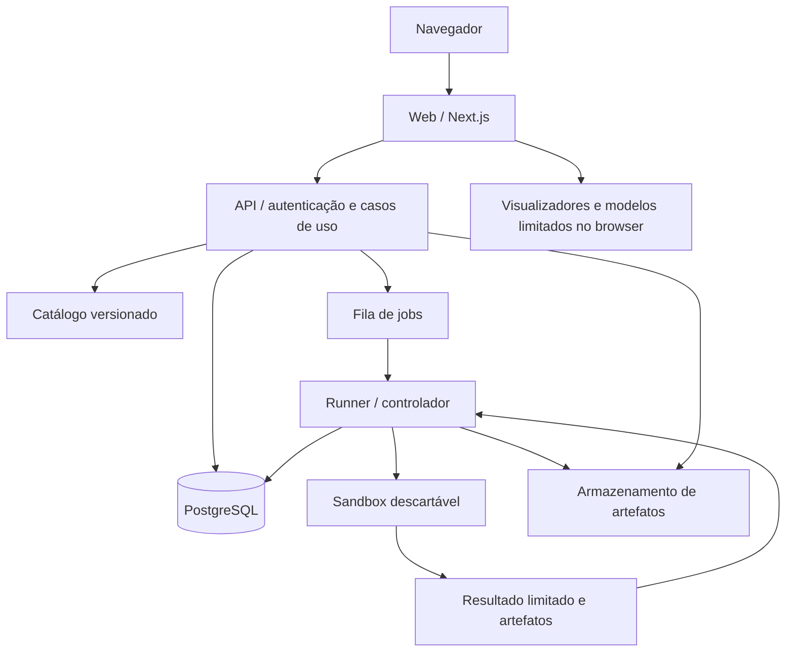

# Arquitetura técnica

## Decisão de stack

O produto terá frontend React em Next.js, API TypeScript independente, PostgreSQL e um serviço de execução isolado. A separação da API permite hospedar a interface em um ambiente web diferente do ambiente Linux necessário aos runners, sem mudar as regras de autorização ou trocar PostgreSQL por outro banco.

| Área | Escolha proposta | Motivo |
| --- | --- | --- |
| Web | Next.js App Router, React, TypeScript estrito | Conteúdo público renderizado no servidor e ilhas interativas nas bancadas |
| Estilo | CSS Modules e propriedades CSS próprias | Controle de composição e identidade sem um tema de componentes pronto |
| Movimento | Motion, carregado onde necessário | Transições contextuais e respeito à preferência de movimento reduzido |
| Editor desktop | Monaco, workers e linguagens hospedados localmente | Modelos por arquivo, seleção, atalhos, diagnósticos e navegação de código |
| Editor mobile | CodeMirror 6 ou adapter de edição equivalente após validação em aparelhos | Monaco declara que browsers mobile não são suportados; a decisão precisa considerar toque e teclado virtual |
| API | Hono em Node.js, contratos validados por Zod | Superfície pequena, endpoints tipados e independência do frontend |
| Banco | PostgreSQL independente, Drizzle e migrations versionadas | Integridade relacional, transações e evolução explícita do esquema |
| Autenticação | Better Auth com sessões persistidas no PostgreSQL | Sessão verificável e revogável, sem implementar criptografia de autenticação própria |
| Fila | PostgreSQL, adapter de fila com lease, deduplicação e entrega ao menos uma vez | Mantém a infraestrutura inicial pequena e exige tratamento explícito de reexecução |
| Runner | Serviço separado em Linux, runtime isolado como gVisor | Código não confiável fica fora da API e do servidor web |
| Artefatos | Armazenamento de objetos ou adapter de filesystem no desenvolvimento | Download controlado por proprietário, tamanho, hash e prazo |
| Testes | Vitest, integração com PostgreSQL real e Playwright | Regras de domínio, transações, isolamento de usuários e fluxos completos |

As versões exatas serão verificadas e fixadas no lockfile na fase de setup. O planejamento não presume que a documentação mais recente represente uma versão já instalada. A escolha final do adapter mobile dependerá de testes de toque, seleção e restauração de arquivos.

Fontes de capacidade: [Next.js App Router](https://nextjs.org/docs/app), [Drizzle com PostgreSQL](https://orm.drizzle.team/docs/get-started/postgresql-new), [Better Auth com Next.js](https://better-auth.com/docs/integrations/next), [Monaco](https://github.com/microsoft/monaco-editor#faq) e [gVisor](https://gvisor.dev/docs/).

A API utiliza o [adapter Node.js do Hono](https://hono.dev/docs/getting-started/nodejs). A suíte seguirá as integrações oficiais de [Vitest](https://vitest.dev/guide/) e [Playwright](https://playwright.dev/docs/intro), com versões fixadas no setup.

## Componentes e fronteiras



O web entrega conteúdo e interação. A API identifica o aluno, valida entradas e aplica regras. O controlador pode provisionar um sandbox, mas suas credenciais não passam ao ambiente que executa o código. O sandbox não acessa PostgreSQL, autenticação, fila, armazenamento ou rede externa. O navegador nunca recebe acesso direto ao banco ou ao controlador.

Avaliações de modelos didáticos também passam por uma execução limitada no serviço de avaliação. O feedback imediato no browser é uma conveniência; não concede autorização, não altera limites e não produz um resultado confiável de conclusão sozinho.

## Organização proposta

```text
apps/
  web/
    src/app/                  # rotas, layouts, metadata e composição
    src/modules/              # apresentações do curso, progresso e bancadas
    src/components/           # componentes compartilhados de produto
    src/design-system/        # tokens, fundamentos e primitives acessíveis
  api/
    src/modules/
      courses/                # catálogo e versões
      learning/               # abrir, continuar e concluir aula
      progress/               # eventos e projeções
      assessments/            # exercícios, quizzes e rubricas
      labs/                   # sessões, drafts e tentativas
      execution/              # jobs, quotas e resultados
      auth/                   # sessões e autorização
    src/infrastructure/       # PostgreSQL, fila, objetos e observabilidade
  runner/
    src/controller/           # leases, cancelamento, coleta e cleanup
    src/engines/              # Python, C, assembler, análise e modelos
packages/
  contracts/                  # schemas públicos de entrada e saída
  content/                    # modelo, importação e catálogo público
  learning-models/            # registradores, memória e semântica determinística
content/
  courses/                    # conteúdo adaptado, fora do JSX
  assessments-private/        # gabaritos e testes reservados
infrastructure/
  migrations/
  runner-images/
  development/
tests/
  integration/
  e2e/
```

Os módulos da API recebem `domain`, `application` e `infrastructure` apenas quando houver comportamento que justifique essas camadas. O frontend organiza apresentação por funcionalidade; não duplica uma Clean Architecture completa para um botão ou visualizador simples.

Ports necessários: `CourseCatalog`, `ProgressRepository`, `AttemptRepository`, `ExecutionQueue`, `SandboxRuntime`, `ArtifactStore`, `SessionReader` e `Clock`. Casos de uso dependem dessas interfaces. Adapters concretos são montados na composição da aplicação. Não criar um repository genérico para todas as tabelas ou uma abstração para cada biblioteca.

## Modelo de conteúdo

O catálogo é validado antes de entrar na aplicação. Sua estrutura é independente de framework:

| Entidade | Campos essenciais |
| --- | --- |
| Course | ID estável, slug, título, descrição, versões, créditos, módulos e política de progresso |
| Module | ID, ordem, objetivo, dificuldade, pré-requisitos, capítulos e duração estimada |
| Chapter | Identidade da página original, hierarquia, fontes e aulas derivadas |
| Lesson | ID estável, revisão, objetivo, pré-requisitos, seções, atividades, resumo e próximos passos |
| Section | ID estável, título, ordem e blocos tipados |
| SourceRef | Repositório, commit, arquivo, intervalo de linhas e hash |
| CodeExample | Linguagem, dialeto, arquitetura, ambiente, arquivos, origem, output esperado e perfil de execução |
| Exercise | Enunciado, estado inicial, entradas permitidas, rubrica, hints e solução comentada |
| Lab | Motor, fixtures, objetivo, parâmetros editáveis, limites e critérios de conclusão |
| Quiz | Questões, IDs de alternativas, feedback e regras de tentativas; gabarito reservado |
| Concept | Termo canônico, aliases, definição curta, fontes e relações |
| InteractiveBlock | Tipo de componente, configuração validada, fixture e ligação à atividade |

Blocos suportados inicialmente: parágrafo, título, lista, destaque conceitual, tabela, imagem, código, diagrama, referência, checkpoint, exercício, quiz e bloco interativo. O tipo discrimina o payload; não haverá `any` ou um blob de HTML a ser interpretado indiscriminadamente.

O `SourceRef` distingue a identidade editorial da posição no arquivo. IDs de aulas e blocos não serão substituídos toda vez que uma linha da fonte mudar. Revisões registram mudanças e mantêm uma migração de âncoras de leitura. Uma atualização de conteúdo não deve apagar progresso ou contar referências como novas aulas por acidente.

### Importação e transformação

1. Ler o clone fixado, validar commit e hashes e produzir um AST com spans.
2. Converter front matter e diretivas GitBook em metadados, links, imagens e embeds reconhecidos.
3. Classificar separadamente código executável, fragmento, definição, saída e diagrama.
4. Aplicar o mapeamento curado de fonte para módulos, capítulos e aulas.
5. Adaptar a explicação e conectar exemplos a atividades e visualizadores.
6. Aplicar correções editoriais registradas, preservando a fonte e a justificativa.
7. Validar referências, assets, largura de dados, versão e permissões de publicação.
8. Gerar catálogo público, índice de busca e metadados de avaliações reservadas.

MDX e componentes arbitrários da fonte não serão executados. O importador aceita um vocabulário explícito, com validação de dados e links. O livro não será transformado apenas em páginas renderizadas de Markdown.

## Modelo de persistência

| Relação | Responsabilidade e invariantes |
| --- | --- |
| `user`, `session`, `account`, `verification` | Esquema gerido pela biblioteca de autenticação, separado de acesso público ao curso |
| `courses` | Identidade e slug únicos |
| `course_versions` | Commit, revisão do catálogo, hash e estado de publicação; FK para curso |
| `lesson_revisions` | ID lógico + versão únicos, ordem, metadados e documento público validado |
| `assessment_definitions` | Revisão, enunciado público e configuração de avaliação reservada; exposição por campos explícitos |
| `lesson_progress` | Uma linha por aluno, aula e versão; estado, âncora, início e conclusão |
| `learning_events` | Eventos imutáveis, ID de deduplicação, aluno, tipo e timestamp do servidor |
| `activity_sessions` | Intervalos ativos limitados; base da estimativa de tempo estudado |
| `assessment_attempts` | Aluno, atividade, revisão, submissão, resultado e feedback; tentativa não implica aprovação |
| `lab_drafts` | Arquivos e ponto da bancada, com versão otimista e limites de tamanho |
| `execution_jobs` | Tentativa, proprietário, perfil, hash da submissão, estado, deadline, lease e resultado limitado |
| `execution_outbox` | Solicitações comprometidas na mesma transação da tentativa antes de entrar na fila |
| `artifacts` | Job, proprietário, chave interna, hash, tamanho, tipo e expiração |

Metadados de módulos e capítulos podem ficar no catálogo versionado, em vez de exigir uma tabela para cada nó de conteúdo. Relações que precisam de integridade, autorização, concorrência ou consulta operacional ficam no banco. JSONB é usado para documentos validados e snapshots limitados, não para evitar modelagem das entidades principais.

Conclusão usa transação e upsert atômico. Há unicidade para eventos por aluno/ID, para progresso por aluno/aula/versão e para uma tentativa associada ao mesmo ID de submissão. NOT NULL, CHECK e FKs complementam a validação da API. As regras de unicidade e integridade seguem a [documentação oficial do PostgreSQL](https://www.postgresql.org/docs/current/ddl-constraints.html); upserts seguem [INSERT / ON CONFLICT](https://www.postgresql.org/docs/current/sql-insert.html).

Índices propostos acompanham consultas reais: progresso por `(user_id, course_version_id)`; retomada por `(user_id, last_visited_at DESC)`; tentativas por `(user_id, assessment_id, created_at DESC)`; jobs do usuário por `(user_id, created_at DESC)`; e fila pendente por estado/deadline. FKs consultadas ou usadas na exclusão precisam de índices adequados. Validar planos com EXPLAIN em volumes representativos e evitar índices redundantes. [Índices multicoluna](https://www.postgresql.org/docs/current/indexes-multicolumn.html).

O adapter de fila usa claim atômico, lease renovável e recuperação por deadline. Nunca mantém uma transação aberta enquanto o código compila ou roda. A operação com `FOR UPDATE SKIP LOCKED` é apropriada à disputa por jobs, mas a entrega continua sujeita a duplicação: tentativas e resultados precisam ser idempotentes. [SELECT e locking](https://www.postgresql.org/docs/current/sql-select.html#SQL-FOR-UPDATE-SHARE).

Credenciais e roles distintas para migrations, API e controlador. A aplicação não usa superuser. Se RLS for adotado como defesa adicional, o contexto do aluno será definido pelo servidor dentro da transação, a role não terá BYPASSRLS e os testes usarão a role real de runtime. Autorização continua explícita nos casos de uso. [Row security do PostgreSQL](https://www.postgresql.org/docs/current/ddl-rowsecurity.html).

## Sessões e autorização

Login, cadastro e recuperação são tratados pela biblioteca, com cookies HttpOnly, Secure em produção, SameSite adequado e origem configurada. Segredos não entram em bundles, parâmetros de URL, logs ou localStorage. A sessão é verificada no backend nas operações de progresso, tentativas, jobs e downloads; redirecionar uma página não substitui autorização da API.

O usuário é obtido da sessão, nunca de um `userId` enviado pelo browser. Todas as leituras e mutações privadas restringem proprietário e revisão. Logout e revogação invalidam o acesso; operações sensíveis não aceitam uma cópia indefinidamente cacheada da sessão. [Sessões do Better Auth](https://better-auth.com/docs/concepts/session-management).

A API terá origem pública consistente com o site, idealmente por `/api` no mesmo domínio. Um proxy/BFF só encaminha rotas e headers permitidos, usa destinos fixos e não aceita um host fornecido pelo cliente. O backend continua verificando sessão, origem e autorização. O banco pode rodar em ambiente próprio ou serviço PostgreSQL escolhido posteriormente, sem vínculo obrigatório com um provider.

No desenvolvimento, email de verificação e recuperação pode usar um capturador local. Produção exige transporte de email configurado antes de oferecer esse fluxo como funcional. Os testes não enviarão mensagens a pessoas reais.

## Progresso

`not_started`, `in_progress` e `completed` são estados de aula, separados do estado de exercícios e laboratórios. A retomada guarda aula, versão, bloco e posição válida; o draft da IDE guarda arquivo e seleção separadamente. A leitura pode usar local cache para feedback e sobrevivência a uma falha de conexão, mas a persistência da conta é do servidor.

Eventos possuem ID de deduplicação. Repetir a conclusão não soma aulas duas vezes. Um heartbeat atrasado não reverte uma conclusão. Intervalos de atividade sobrepostos entre duas abas não são somados duas vezes. O servidor limita deltas de tempo e não aceita timestamps futuros ou horas arbitrárias fornecidas pelo cliente.

O dashboard consulta projeções calculadas sobre esses dados: próximo ponto visitado, aulas concluídas, atividades aprovadas, tempo estimado e última atividade. Novo aluno começa em zero. Não há progresso fictício, streak sem eventos ou métricas de demonstração disfarçadas de dados da conta.

## Contratos principais

| Operação | Garantia no servidor |
| --- | --- |
| Abrir curso/aula | Catálogo publicado, IDs válidos e versão conhecida |
| Iniciar aula | Upsert para o aluno da sessão e evento deduplicado |
| Salvar retomada | Âncora válida e concorrência por versão; sem modificar conclusão por heartbeat |
| Concluir aula | Critérios declarados e invariantes de estado, transação idempotente |
| Enviar quiz/exercício | Submissão validada, revisão fixa e avaliação reservada |
| Executar código | Sessão, quota, linguagem/perfil permitido e job isolado |
| Consultar/cancelar job | Proprietário verificado e transição válida de estado |
| Salvar draft | Proprietário, arquivos virtuais e limites; sem paths no host |
| Baixar artefato | Proprietário, integridade, validade e tipo permitido |

Os schemas públicos nunca incluem gabaritos reservados, paths internos, tokens de infraestrutura ou detalhes do runtime que não ajudem o aluno. Errors têm códigos estáveis e mensagens úteis; logs técnicos ficam no servidor com IDs de correlação.

## Performance e publicação

Páginas públicas usam renderização prévia ou SSR; dados privados usam respostas sem cache público. Monaco, workers, motores de análise e visualizadores complexos são carregados sob demanda. A home usa os mesmos modelos educativos reduzidos, sem carregar toda a IDE. Busca recebe um índice compacto do catálogo; o conteúdo integral de todas as aulas não vai no primeiro bundle.

O conteúdo público recebe metadata, canonical, Open Graph, sitemap e dados estruturados de Course/LearningResource. Dashboard, progresso, auth e dados privados não entram no sitemap. Imagens têm dimensões definidas, versões adequadas e carregamento progressivo. Não usar datas inventadas nem inserir páginas sem autorização de publicação.

A topologia deve ser validada em desenvolvimento com PostgreSQL real e depois em staging. Um ambiente web que não ofereça TCP se comunica com a API por HTTPS; o PostgreSQL continua atrás dela. O serviço de sandbox precisa de um ambiente Linux dedicado, independente da hospedagem web.
